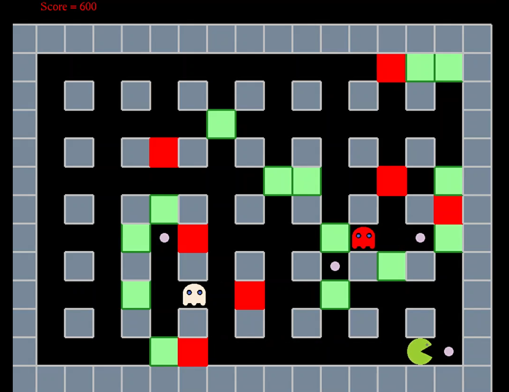
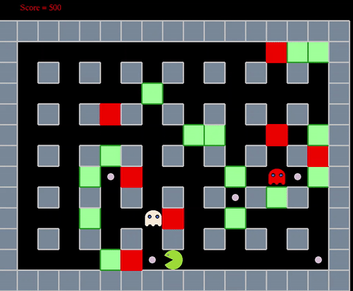

# Bomber Packman C++

This is a 2D game made entirely in C++, with the help of GLUT library. The project is made is Windows using Visual Studio.

Its the traditional Packman game, with a twist that lets you add a bomb anywhere on the map which explodes in just enough time to steer clear from the blastzone

## Demo

### Image

### Video

